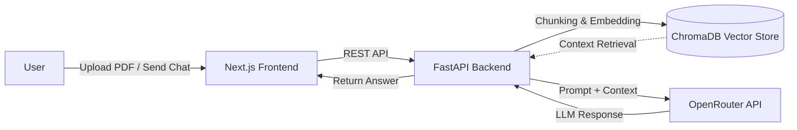

<div align="center">

# 🤖 Porsesh AI (پرسش هوش مصنوعی)

[](https://porsesh-ai.vercel.app)
[](https://github.com/m-mohammadimanesh/porsesh-ai)
[](https://opensource.org/licenses/MIT)

[](https://nextjs.org/)
[](https://fastapi.tiangolo.com/)
[](https://tailwindcss.com/)
[](https://openrouter.ai/)

**A professional, bilingual AI chatbot powered by Nvidia Nemotron Ultra with RAG capabilities for PDF analysis.**
<br>
**یک چت‌بات حرفه‌ای و دوزبانه مبتنی بر هوش مصنوعی با قابلیت تحلیل فایل‌های PDF.**

</div>

---

## 📖 About The Project / درباره پروژه

**🇬🇧 English:**
Porsesh AI is a full-stack, AI-powered conversational interface designed to act as your intelligent assistant. Not only does it offer seamless real-time chatting using state-of-the-art models via OpenRouter (currently powered by Nvidia's Nemotron Ultra), but it also features **Retrieval-Augmented Generation (RAG)**. This allows you to upload any PDF document and instantly ask questions about its content. Built with a stunning dark/light mode interface using Next.js 14 and supported by a robust Python FastAPI backend with ChromaDB vector storage.

**🇮🇷 Persian (فارسی):**
پرسش AI یک دستیار هوشمند و تمام‌عیار است که نه تنها امکان چت پیشرفته و لحظه‌ای را با استفاده از مدل‌های قدرتمند OpenRouter (مانند Nvidia Nemotron Ultra) فراهم می‌کند، بلکه به لطف سیستم **RAG** امکان آپلود فایل‌های PDF و استخراج پاسخ از محتوای آن‌ها را به شما می‌دهد. این پروژه با رابط کاربری مدرن، پشتیبانی از حالت تاریک/روشن و فونت‌های استاندارد فارسی در Next.js توسعه یافته و از یک بک‌اند قدرتمند با پایتون و FastAPI بهره می‌برد.

---

## ✨ Features / ویژگی‌ها

- 💬 **Intelligent Chat (چت هوشمند):** Real-time conversational AI powered by OpenRouter.
- 📄 **PDF Knowledge Extraction (تحلیل PDF):** Upload PDFs and ask targeted questions based on the document's content using ChromaDB vector search.
- 🌓 **Dark & Light Mode (حالت تاریک و روشن):** Beautiful and responsive UI adapting to system preferences.
- 🌐 **Bilingual Support (دوزبانه):** Built-in support for right-to-left (RTL) Persian typography (Vazirmatn) and English (Inter).
- 📝 **Markdown & LaTeX Rendering (پشتیبانی از مارک‌داون و ریاضی):** Code highlighting and complex math equations render beautifully right inside the chat.

---

## 📸 Screenshots / تصاویر

> *Placeholders for screenshots - Add your images here!*

| ☀️ Light Mode | 🌙 Dark Mode |
| :---: | :---: |
|  |  |

---

## ⚙️ How It Works / نحوه کارکرد



---

## 🚀 Installation & Setup / راه‌اندازی

### 1. Clone the repository
```bash
git clone https://github.com/m-mohammadimanesh/porsesh-ai.git
cd porsesh-ai
```

### 2. Backend Setup (FastAPI)
```bash
cd backend
python -m venv venv
source venv/bin/activate  # On Windows use: venv\Scripts\activate
pip install -r requirements.txt
```
Run the backend server:
```bash
uvicorn main:app --reload
```

### 3. Frontend Setup (Next.js)
```bash
cd frontend
npm install
npm run dev
```

---

## 🔐 Environment Variables / متغیرهای محیطی

### Backend (`/backend/.env`)
| Variable | Description |
| :--- | :--- |
| `OPENROUTER_API_KEY` | Your API key from OpenRouter.ai |
| `CHROMA_DB_PATH` | Path to store local vector data (e.g. `./chroma_db`) |
| `MAX_PDF_SIZE_MB` | Maximum allowed size for PDF uploads (e.g. `10`) |

### Frontend (`/frontend/.env.local`)
| Variable | Description |
| :--- | :--- |
| `NEXT_PUBLIC_API_URL` | Your FastAPI backend URL (e.g. `http://localhost:8000`) |

---

## 📂 Project Structure / ساختار پروژه

```text
porsesh-ai/
├── backend/                  # Python FastAPI Backend
│   ├── models/               # Pydantic schemas
│   ├── services/             # Core logic (AI, Vector, PDF)
│   ├── main.py               # API Endpoints
│   └── requirements.txt      # Python dependencies
└── frontend/                 # Next.js 14 Frontend
    ├── src/
    │   ├── app/              # Next.js App Router & Layouts
    │   ├── components/       # UI Components (ChatWindow, PDFUploader)
    │   └── services/         # Frontend API integrations
    └── next.config.mjs       # Next.js Configuration
```

---

## 🤝 Contributing / مشارکت

Contributions, issues, and feature requests are welcome! 
Feel free to check the [issues page](https://github.com/m-mohammadimanesh/porsesh-ai/issues).

---

## 📄 License / مجوز

This project is licensed under the [MIT License](https://opensource.org/licenses/MIT).

---

## 📬 Contact / ارتباط

**Mohammad**  
- GitHub: [@m-mohammadimanesh](https://github.com/m-mohammadimanesh)
- Project Link: [https://porsesh-ai.vercel.app](https://porsesh-ai.vercel.app)

<div align="center">
  <i>If you found this project helpful, please give it a ⭐️!</i>
</div>
