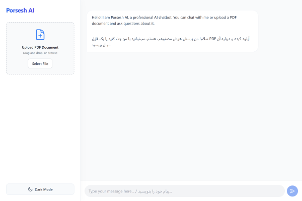
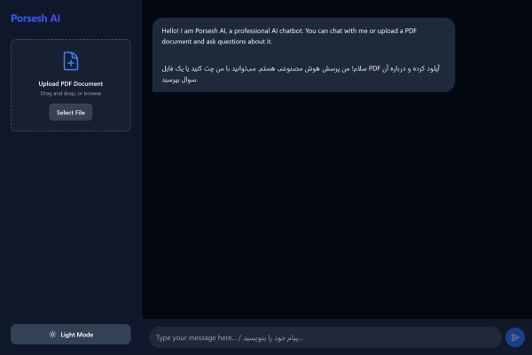

> 🌐 Language: **English** | [فارسی](#persian)

<div align="center">

# 🤖 Porsesh AI

[](https://porsesh-ai.vercel.app)
[](https://github.com/m-mohammadimanesh/porsesh-ai)
[](https://opensource.org/licenses/MIT)

[](https://nextjs.org/)
[](https://www.typescriptlang.org/)
[](https://fastapi.tiangolo.com/)
[](https://www.python.org/)

</div>

---

Porsesh AI is a full-stack, AI-powered conversational interface designed to act as your intelligent assistant. Using state-of-the-art models via Groq (powered by LLaMA 3.3 70B) and Retrieval-Augmented Generation (RAG) with ChromaDB, it allows you to upload any PDF document and instantly ask questions about its content.

---

## ✨ Features

- 💬 **Intelligent Chat:** Real-time conversational AI powered by Groq.
- 📄 **PDF Knowledge Extraction:** Upload PDFs and ask targeted questions based on the document's content using ChromaDB vector search.
- 🌓 **Dark & Light Mode:** Beautiful and responsive UI adapting to system preferences.
- 🌐 **Bilingual Support:** Built-in support for right-to-left (RTL) Persian typography (Vazirmatn) and English (Inter).
- 📝 **Markdown & LaTeX Rendering:** Code highlighting and complex math equations render beautifully right inside the chat.

---

## 🖼️ Screenshots

<p align="center">
  
  &nbsp;
  
</p>

---

## 🚀 Quick Start

### 1. Clone the repository
```bash
git clone https://github.com/m-mohammadimanesh/porsesh-ai.git
cd porsesh-ai
```

### 2. Backend Setup (FastAPI)
```bash
cd backend
python -m venv venv
source venv/bin/activate  # On Windows use: venv\Scripts\activate
pip install -r requirements.txt
uvicorn main:app --reload
```

### 3. Frontend Setup (Next.js)
```bash
cd frontend
npm install
npm run dev
```

---

## ⚙️ Environment Variables

### Backend (`/backend/.env`)
| Variable | Description |
| :--- | :--- |
| `OPENROUTER_API_KEY` | Your API key from OpenRouter.ai |
| `CHROMA_DB_PATH` | Path to store local vector data (e.g. `./chroma_db`) |
| `MAX_PDF_SIZE_MB` | Maximum allowed size for PDF uploads (e.g. `10`) |

### Frontend (`/frontend/.env.local`)
| Variable | Description |
| :--- | :--- |
| `NEXT_PUBLIC_API_URL` | Your FastAPI backend URL (e.g. `http://localhost:8000`) |

---

## 📁 Project Structure

```text
porsesh-ai/
├── backend/                  # Python FastAPI Backend
│   ├── models/               # Pydantic schemas
│   ├── services/             # Core logic (AI, Vector, PDF)
│   ├── main.py               # API Endpoints
│   └── requirements.txt      # Python dependencies
└── frontend/                 # Next.js 14 Frontend
    ├── src/
    │   ├── app/              # Next.js App Router & Layouts
    │   ├── components/       # UI Components (ChatWindow, PDFUploader)
    │   └── services/         # Frontend API integrations
    └── next.config.mjs       # Next.js Configuration
```

---

## 🔧 How It Works

```text
[ User ] --(Uploads PDF / Chats)--> [ Next.js Frontend ]
                                            |
                                       (REST API)
                                            v
[ ChromaDB ] <--(Vector Context)-- [ FastAPI Backend ]
                                            |
                                    (Prompt + Context)
                                            v
                                 [ Groq API (AI) ]
```

---

## 📄 License

This project is licensed under the [MIT License](https://opensource.org/licenses/MIT).

---

## 👤 Author/Contact

**Mohammad Mohammadi-Manesh**  
- GitHub: [@m-mohammadimanesh](https://github.com/m-mohammadimanesh)
- Project Link: [https://porsesh-ai.vercel.app](https://porsesh-ai.vercel.app)

<br><br>

<a name="persian"></a>
---
---

> 🌐 زبان: [English](#) | **فارسی**

<div align="center" dir="rtl">

# 🤖 پرسش AI

[](https://porsesh-ai.vercel.app)
[](https://github.com/m-mohammadimanesh/porsesh-ai)
[](https://opensource.org/licenses/MIT)

[](https://nextjs.org/)
[](https://www.typescriptlang.org/)
[](https://fastapi.tiangolo.com/)
[](https://www.python.org/)

</div>

<div dir="rtl">

پرسش AI یک دستیار هوشمند و تمام‌عیار است که نه تنها امکان چت پیشرفته و لحظه‌ای را با استفاده از مدل‌های قدرتمند Groq (مدل LLaMA 3.3 70B) فراهم می‌کند، بلکه به لطف سیستم **RAG** با استفاده از ChromaDB، امکان آپلود فایل‌های PDF و استخراج مستقیم پاسخ از محتوای آن‌ها را به شما می‌دهد.

---

## ✨ ویژگی‌ها

- 💬 **چت هوشمند:** گفتگوی لحظه‌ای با هوش مصنوعی قدرتمند با استفاده از API Groq.
- 📄 **استخراج دانش از PDF:** فایل‌های PDF خود را آپلود کنید و بر اساس محتوای آن مستقیماً سوال بپرسید.
- 🌓 **حالت تاریک و روشن:** رابط کاربری زیبا و واکنش‌گرا هماهنگ با تنظیمات سیستم.
- 🌐 **پشتیبانی کامل دوزبانه:** پشتیبانی ساختاری از چیدمان راست‌چین (RTL) و فونت‌های استاندارد فارسی (وزیرمتن) و انگلیسی (Inter).
- 📝 **پشتیبانی از مارک‌داون و ریاضی:** نمایش زیبای کدهای برنامه‌نویسی و فرمول‌های پیچیده ریاضی با KaTeX در محیط چت.

---

## 🖼️ تصاویر محیط برنامه


<p align="center">
  
  &nbsp;
  
</p>

---

## 🚀 راهنمای نصب سریع

### 1. دریافت کدهای پروژه
```bash
git clone https://github.com/m-mohammadimanesh/porsesh-ai.git
cd porsesh-ai
```

### 2. راه‌اندازی بک‌اند (FastAPI)
```bash
cd backend
python -m venv venv
source venv/bin/activate  # در ویندوز: venv\Scripts\activate
pip install -r requirements.txt
uvicorn main:app --reload
```

### 3. راه‌اندازی فرانت‌اند (Next.js)
```bash
cd frontend
npm install
npm run dev
```

---

## ⚙️ متغیرهای محیطی

### بک‌اند (`/backend/.env`)
| متغیر | توضیحات |
| :--- | :--- |
| `OPENROUTER_API_KEY` | کلید دسترسی به API هوش مصنوعی OpenRouter |
| `CHROMA_DB_PATH` | مسیر ذخیره‌سازی داده‌های برداری (مثلاً `./chroma_db`) |
| `MAX_PDF_SIZE_MB` | حداکثر حجم مجاز برای آپلود PDF (مثلاً `10`) |

### فرانت‌اند (`/frontend/.env.local`)
| متغیر | توضیحات |
| :--- | :--- |
| `NEXT_PUBLIC_API_URL` | آدرس سرور بک‌اند FastAPI (مثلاً `http://localhost:8000`) |

---

## 📁 ساختار پروژه

```text
porsesh-ai/
├── backend/                  # بک‌اند با پایتون و FastAPI
│   ├── models/               # شمای داده‌ها (Pydantic)
│   ├── services/             # منطق اصلی برنامه (هوش مصنوعی، دیتابیس، PDF)
│   ├── main.py               # مسیرها و روت‌های API
│   └── requirements.txt      # کتابخانه‌های پایتون مورد نیاز
└── frontend/                 # فرانت‌اند با Next.js 14
    ├── src/
    │   ├── app/              # روت‌های اصلی و قالب‌بندی
    │   ├── components/       # اجزای رابط کاربری (پنجره چت، آپلود PDF)
    │   └── services/         # ارتباط با API
    └── next.config.mjs       # پیکربندی Next.js
```

---

## 🔧 نحوه کارکرد

```text
[ کاربر ] --(آپلود فایل / چت)--> [ فرانت‌اند Next.js ]
                                         |
                                     (REST API)
                                         v
[ دیتابیس Chroma ] <--(بازیابی زمینه)-- [ بک‌اند FastAPI ]
                                         |
                                     (متن + داده‌ها)
                                         v
                               [ هوش مصنوعی Groq ]
```

---

## 📄 مجوز انتشار

این پروژه تحت لایسنس [MIT](https://opensource.org/licenses/MIT) منتشر شده است.

---

## 👤 درباره سازنده

**محمد محمدی‌منش**  
- گیت‌هاب: [@m-mohammadimanesh](https://github.com/m-mohammadimanesh)
- لینک پروژه: [https://porsesh-ai.vercel.app](https://porsesh-ai.vercel.app)

</div>
